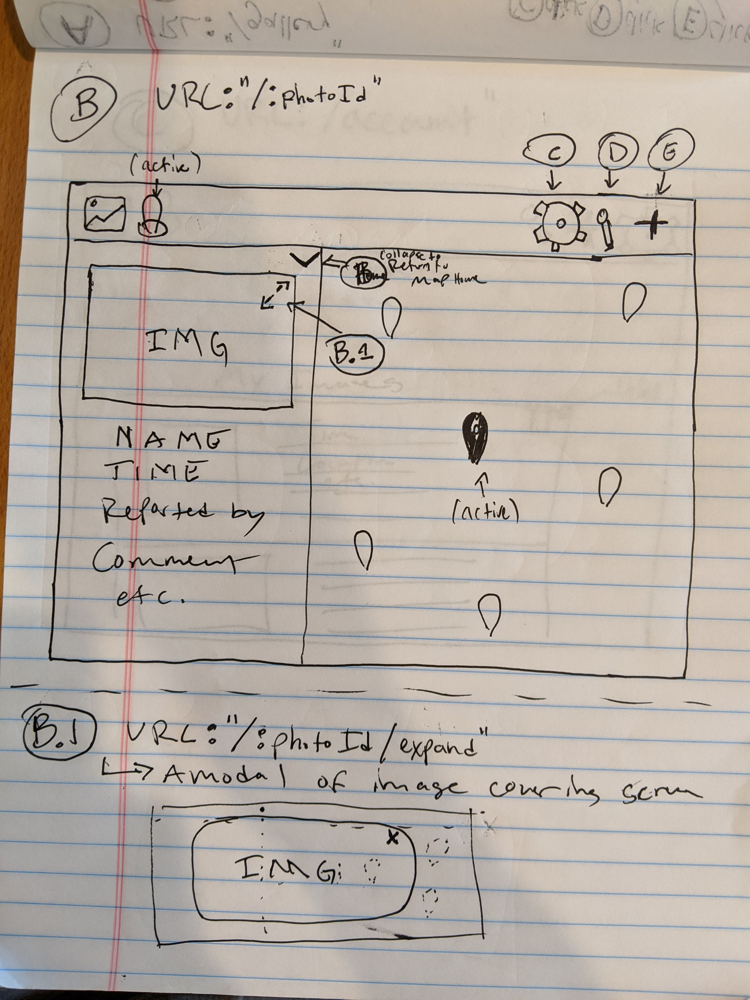

# SpotZoo
    
### Developers   
* Chad   
* Marby   
* Josh    

### Software goal and concept
“As a bird watcher, I want to know where I can see cool birds near me, so that I can go see them too.”    
“As a runner, I want to know where the racoons are around Lake Merritt, so that I can avoid them.”    
"As a hunter..."

### Project Specs
#### Pages
* data
    * animal
        * pull animal names from Wikipedia to provide as options?
    * timestamp
    * submitter
    * comment
    * image_url (from website)
    * lat
    * lng
* pages
    * Homepage
        * Navbar
            * Home (map icon)
            * Searchbar
            * Add (+ map icon)
        * Sidebar
            * Cards with submitted animals
                * Image thumbnail
                * Name
                * Time
                * Submitted by
                * Comment
        * Main
            * Map
                * Markers
    * Add
        * Navbar
            * Home (map icon)
            * Searchbar
            * Add (+ map icon)
        * Sidebar
            * Animal Form for inputs
                * Animal
                * Time
                * Submitted by
                * Comment
                * Image Url
                * Submit button
        * Main
            * Map
                * Marker -> draggable location indicates where the animal was sighted

#### Cursory Wireframes

##### URL: "/"  Page-Component: Home  
   

##### URL: "/spotting/:spottingId"  Page-Component: Spotting  

#### URL: "/contribute"  Page-Component: Contribute  
     

### Stretch specs    
* image upload   
* accounts with login / logout   
* wikipedia API that provides information about the animal selected   
* image gallery   

### Challenges / Unknowns   
* Too many features, too little time --> reduced specs to MVP   

### Roles   
* Josh -> Design / Front-end engineer   
* Chad -> Front-end / Back-end engineer   
* Marby -> Back-end / Data engineer   

### Components   
* Map   
    * Markers for unselected and selected animals  
    * tooltip for selected marker?  
* SmallCard
    * thumbnail   
    * text   
* BigCard   
    * thumbnail  
    * text  
* NavBar  
    * title  
    * map icon  
    * add icon  
* AddCard  
    * input boxes  
    * submit button  